## PROJECT 7
### In this project you will implement a solution that consists of following components:

1. Infrastructure: AWS
1. Webserver Linux: Red Hat Enterprise Linux 8
2. Database Server: Ubuntu 20.04 + MySQL
3. Storage Server: Red Hat Enterprise Linux 8 + NFS Server
4. Programming Language: PHP
5. Code Repository: GitHub

On the diagram below you can see a common pattern where several stateless Web Servers share a common database and also access the same files using Network File Sytem (NFS) as a shared file storage. Even though the NFS server might be located on a completely separate hardware – for Web Servers it look like a local file system from where they can serve the same files.


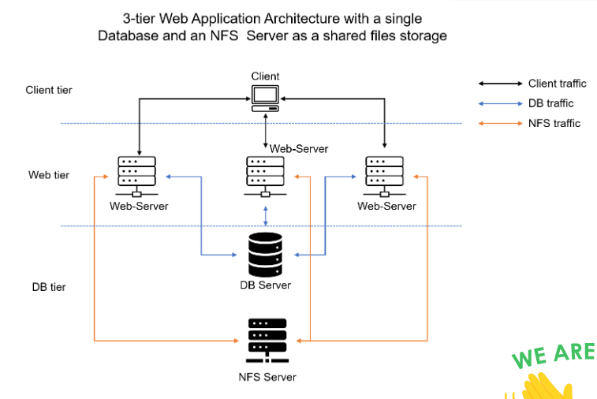

### STEP 1 – PREPARE NFS SERVER


Spin up a new EC2 instance with RHEL Linux 8 Operating System.

Based on your LVM experience from Project 6, Configure LVM on the Server.

Instead of formating the disks as ext4 you will have to format them as xfs

Ensure there are 3 Logical Volumes. **lv-op, lv-apps, and lv-logs**

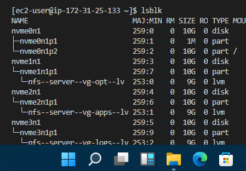

Create mount points on /mnt directory for the logical volumes as follow:
Mount lv-apps on /mnt/apps – To be used by webservers

Mount lv-logs on /mnt/logs – To be used by webserver logs

Mount lv-opt on /mnt/opt – To be used by Jenkins server in Project 8

Install NFS server, configure it to start on reboot and make sure it is u and running

```
    sudo yum -y update
    sudo yum install nfs-utils -y
    sudo systemctl start nfs-server.service
    sudo systemctl enable nfs-server.service
    sudo systemctl status nfs-server.service

```

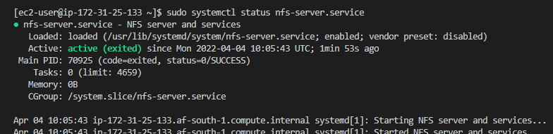

Export the mounts for webservers’ subnet cidr to connect as clients. For simplicity, you will install your all three Web Servers inside the same subnet, but in production setup you would probably want to separate each tier inside its own subnet for higher level of security.
 To check your subnet cidr – open your EC2 details in AWS web console and locate ‘Networking’ tab and open a Subnet link:


Make sure we set up permission that will allow our Web servers to read, write and execute files on NFS:

```
    sudo chown -R nobody: /mnt/apps
    sudo chown -R nobody: /mnt/logs
    sudo chown -R nobody: /mnt/opt

    sudo chmod -R 777 /mnt/apps
    sudo chmod -R 777 /mnt/logs
    sudo chmod -R 777 /mnt/opt

    sudo systemctl restart nfs-server.service

```

### Configure access to NFS for clients within the same subnet (example of Subnet CIDR – 172.31.32.0/20 ):


       `sudo vi /etc/exports`


```
/mnt/apps <Subnet-CIDR>(rw,sync,no_all_squash,no_root_squash)
/mnt/logs <Subnet-CIDR>(rw,sync,no_all_squash,no_root_squash)
/mnt/opt <Subnet-CIDR>(rw,sync,no_all_squash,no_root_squash)
```

### Esc + :wq!

        `sudo exportfs -arv`

  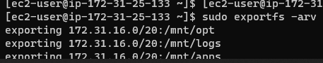  

Check which port is used by NFS and open it using Security Groups (add new Inbound Rule)

       `rpcinfo -p | grep nfs`

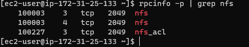  

Important note: In order for NFS server to be accessible from your client, you must also open following ports: TCP 111, UDP 111, UDP 2049

## STEP 2 — CONFIGURE THE DATABASE SERVER

launch an ubuntu ec2 instance that will serve as db server

Install MySQL server

Create a database and name it tooling

Create a database user and name it webaccess with password 'onyeka12345'

Grant permission to webaccess user on tooling database to do anything only from the webservers subnet cidr

## Step 3 — Prepare the Web Servers

We need to make sure that our Web Servers can serve the same content from shared storage solutions, in our case – NFS Server and MySQL database.
You already know that one DB can be accessed for reads and writes by multiple clients. For storing shared files that our Web Servers will use – we will utilize NFS and mount previously created Logical Volume lv-apps to the folder where Apache stores files to be served to the users (/var/www).

This approach will make our Web Servers stateless, which means we will be able to add new ones or remove them whenever we need, and the integrity of the data (in the database and on NFS) will be preserved.

### During the next steps we will do following:

Configure NFS client (this step must be done on all three servers)

Deploy a Tooling application to our Web Servers into a shared NFS folder

Configure the Web Servers to work with a single MySQL database

### Install and configure NFS client

1. Launch a new EC2 instance with RHEL 8 Operating System

1. Install nfs client

        'sudo yum install nfs-utils nfs4-acl-tools -y'

2. Mount /var/www/ and target the NFS server’s export for apps

        'sudo mkdir /var/www'

        'sudo mount -t nfs -o rw,nosuid <NFS-Server-Private-IP-Address>:/mnt/apps /var/www'

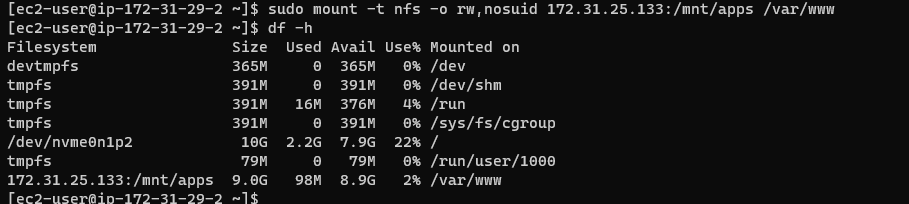  

3. Verify that NFS was mounted successfully by running df -h. Make sure that the changes will persist on Web Server after reboot:

        'sudo vi /etc/fstab'

add following line

'<NFS-Server-Private-IP-Address>:/mnt/apps /var/www nfs defaults 0 0'

4. Install Remi’s repository, Apache and PHP

```
sudo yum install httpd -y
sudo dnf install https://dl.fedoraproject.org/pub/epel/epel-release-latest-8.noarch.rpm
sudo dnf install dnf-utils http://rpms.remirepo.net/enterprise/remi-release-8.rpm
sudo dnf module reset php
sudo dnf module enable php:remi-7.4
sudo dnf install php php-opcache php-gd php-curl php-mysqlnd
sudo systemctl start php-fpm
sudo systemctl enable php-fpm
sudo setsebool -P httpd_execmem 1
```

### Repeat steps 1-5 for another 2 Web Servers.

6. Verify that Apache files and directories are available on the Web Server in /var/www and also on the NFS server in /mnt/apps. If you see the same files – it means NFS is mounted correctly. You can try to create a new file touch test.txt from one server and check if the same file is accessible from other Web Servers.

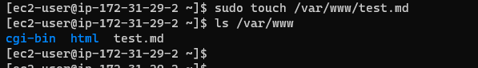 

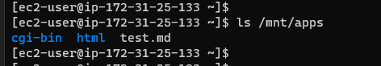 

7. Locate the log folder for Apache on the Web Server 

        'sudo ls /var/log'

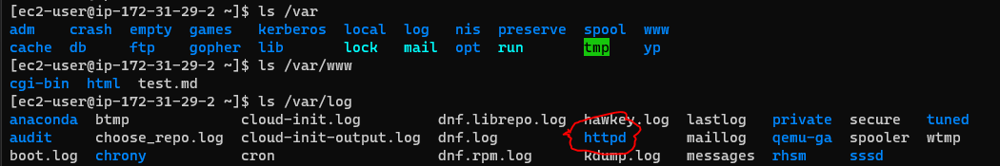

and mount it to NFS server’s export for logs with the command below

'sudo mount -t nfs -o rw,nosuid <NFS-Server-Private-IP-Address>:/mnt/logs /var/log/httpd'

Repeat step №4 to make sure the mount point will persist after reboot.

8. Fork the tooling source code from 'Darey.io Github Account' to your Github account. You have to install git and initialise the repository before you can be able to fork.

        'sudo yum install git'

        'git init'

        'git clone <https address of the repository you want to fork>


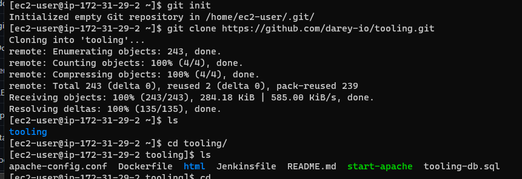

9. Deploy the tooling website’s code to the Webserver. Ensure that the 'html folder' from the repository is deployed to '/var/www/html'. From inside the tooling folder, run this command

        'sudo cp -R html/. /var/www/html'

This will copy recurssively the content of the html folder that is in the tooling folder into the html folder which is in the /var/www folder

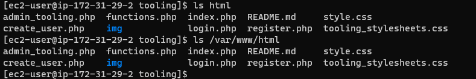

### Note 1: Do not forget to open TCP port 80 on the Web Server.

### Note 2: If you encounter 403 Error – check permissions to your /var/www/html folder and also disable SELinux 'sudo setenforce 0'

To make this change permanent – open following config file **sudo vi /etc/sysconfig/selinux** and set **SELINUX=disabled** then restrt httpd.
### Trouble shooting

Check whether aoache is up and running with this command

        'sudo systemctl status httpd'

        'sudo setenforce 0'

        'sudo vi /etc/sysconfig/selinux'

Set **SELINUX=disabled**

        'sudo systemctl restart httpd'

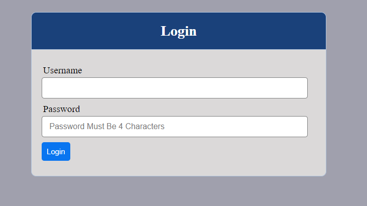

10. Update the website’s configuration to connect to the database (in /var/www/html/functions.php file).

        'sudo vi /var/www/html/functions.php'

update the database user = webaccess, the password = onyeka12345, the private ip address of the database

 Apply tooling-db.sql script to your database using this command but first install mysql client and remember to run the command from **tooling** folder and open mysql port for the database server to the private ip address of the webserver

        'sudo yum install mysql'

        'sudo vi /etc/mysql/mysql.conf.d/mysqld.cnf'

        change the binding address to 0.0.0.0

        'sudo systemctl restart mysql'

        'mysql -h <private ip of the database server> -u webaccess -p tooling < tooling-db.sql

11. Go back to the database terminal. Create in MySQL a new admin user with username: myuser and password: password:

        'show databases;'

        'use tooling;'

        'show tables;'

        'select * from users;'


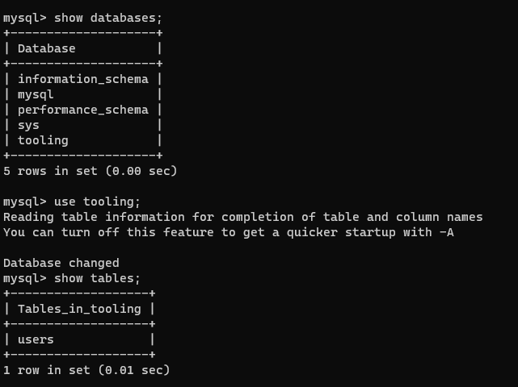


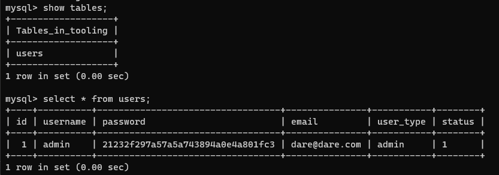


INSERT INTO ‘users’ (‘id’, ‘username’, ‘password’, ’email’, ‘user_type’, ‘status’) VALUES
-> (1, ‘myuser’, ‘5f4dcc3b5aa765d61d8327deb882cf99’, ‘user@mail.com’, ‘admin’, ‘1’);


Open the website in your browser http://<Web-Server-Public-IP-Address-or-Public-DNS-Name>/index.php and make sure you can login into the webste with user = admin, password = admin

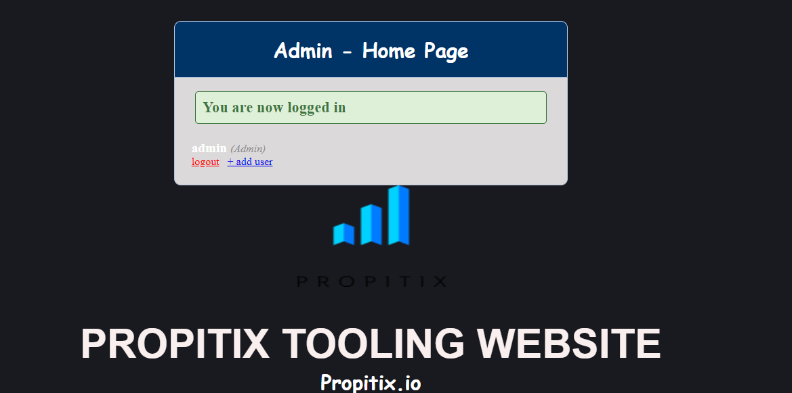


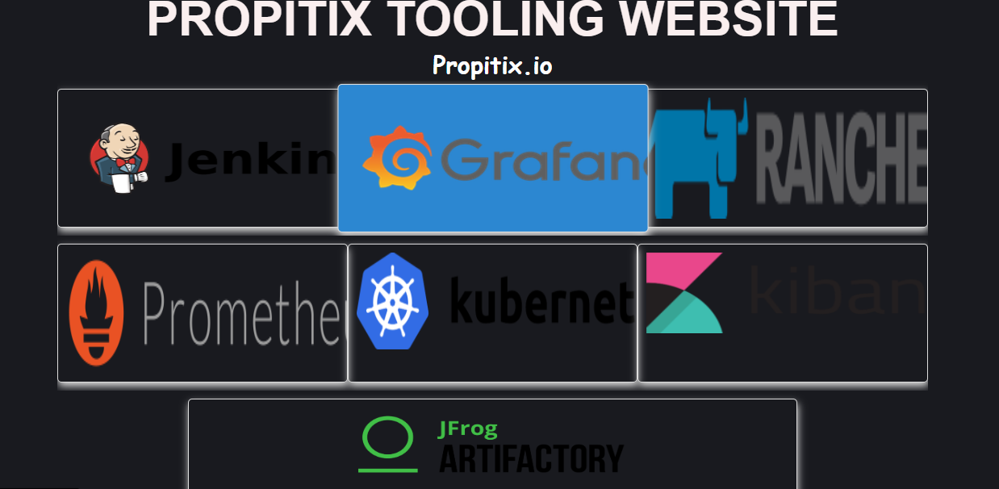


## End of Project 7